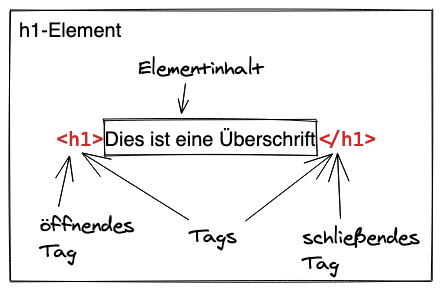

Ein HTML-Dokument ist ein Text-Dokument, das einerseits aus den darzustellenden Inhalten
(Text, Bilder, Links, usw.) besteht und andererseits bestimmte Elemente zur Auszeichnung
der unterschiedlichen Inhaltstypen enthält. Soll eine Webseite z.B. eine Hauptüberschrift
haben, dann wird diese im HTML-Dokument wie folgt in Textform angegeben:

```html
<h1>Dies ist eine Überschrift</h1>
```

Wird das zugehörige HTML-Dokument im Browser geladen, dann erscheint diese Überschrift
vielleicht wie folgt:

<h1 style="font-family: serif;">Dies ist eine Überschrift</h1>

Abhängig davon, welcher Browser verwendet wird und ob das HTML-Dokument auf einem Laptop oder
Smartphone geladen wird, kann die Darstellung dieser Überschrift jeweils leicht abweichen.
Aber in der Regel erscheint eine Überschrift fettgedruckt und in größeren Buchstaben.

Schauen wir uns nochmals die Überschrift in HTML an:

```html
<h1>Dies ist eine Überschrift</h1>
```

Mit der „Markierung“ `<h1>` wird der Beginn einer Überschrift angezeigt. Es folgt die
eigentliche Überschrift als gewöhnlicher Text und mit `</h1>` endet die „Markierung“
oder „Auszeichnung“ (auf Englisch _Markup_) dieser Überschrift. Daher wird HTML als
Auszeichnungssprache bezeichnet (HTML steht für _Hypertext Markup Language_).

Auf Englisch werden diese „Markierungen“ wie z.B. `<h1>` und `</h1>` **Tags** genannt.
Insbesondere ist `<h1>` ein **öffnendes Tag** und `</h1>` ist das zugehörige **schließende Tag**.
Zusammen mit dem Text-Inhalt der Überschrift zwischen `<h1> ... </h1>` sprechen wir
von einem `h1`**-Element**. Der Name eines Tags ist also gleichzeitig der Elementname,
welcher von spitzen Klammern umgeben ist bzw. zwischen dem „kleiner als“-Zeichen `<` und dem
„größer als“-Zeichen `>` steht. Zu beachten ist, dass schließende Tags nach dem
`<`-Zeichen einen Schrägstrich `/` enthalten, damit eindeutig ist, dass dies hiermit
das Element endet.



- Attribute, Schachtelung, leere Elemente, Kinder, etc.
- valid/invalid/browsers, webhint/lighthouse/devtools
