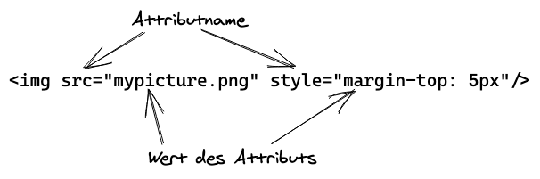

import MultipleChoice from "../../components/multiple-choice"

Ein HTML-Dokument ist ein Text-Dokument, das einerseits aus den darzustellenden Inhalten
(Text, Links, usw.) besteht und andererseits bestimmte Elemente zur Auszeichnung
der unterschiedlichen Inhaltstypen enthält. Außerdem können
weitere Medien wie Bilder oder Videos eingebunden werden. Soll eine Webseite z.B. eine Hauptüberschrift
haben, dann wird diese im HTML-Dokument in Textform so angegeben:

```html
<h1>Dies ist eine Überschrift</h1>
```

Wird das zugehörige HTML-Dokument im Browser geladen, dann erscheint diese Überschrift
zum Beispiel in dieser Darstellung:

<h1 style="font-family: serif;">Dies ist eine Überschrift</h1>

Abhängig davon, welcher Browser verwendet wird und ob das HTML-Dokument auf einem Laptop oder
Smartphone geladen wird, kann die Darstellung dieser Überschrift jeweils leicht abweichen.
Aber in der Regel erscheint eine Überschrift fettgedruckt und in größeren Buchstaben.

Schauen wir uns nochmals die Überschrift in HTML an:

```html
<h1>Dies ist eine Überschrift</h1>
```

Mit der „Markierung“ `<h1>` wird der Beginn einer Überschrift angezeigt. Es folgt die
eigentliche Überschrift als gewöhnlicher Text und mit `</h1>` endet die „Markierung“
oder „Auszeichnung“ (auf Englisch _Markup_) dieser Überschrift. Daher wird HTML als
Auszeichnungssprache bezeichnet (HTML steht für _Hypertext Markup Language_).

Auf Englisch werden diese „Markierungen“ wie z.B. `<h1>` und `</h1>` **Tags** genannt.
Insbesondere ist `<h1>` ein **öffnendes Tag** und `</h1>` ist das zugehörige **schließende Tag**.
Zusammen mit dem Text-Inhalt der Überschrift zwischen `<h1> ... </h1>` sprechen wir
von einem `h1`**-Element**. Der Name eines Tags ist also gleichzeitig der Elementname,
welcher von spitzen Klammern umgeben ist bzw. zwischen dem „kleiner als“-Zeichen `<` und dem
„größer als“-Zeichen `>` steht. Zu beachten ist, dass schließende Tags nach dem
`<`-Zeichen einen Schrägstrich `/` enthalten, damit eindeutig ist, dass hiermit
das Element endet. Zwischen den Tags wird der Elementinhalt definiert.


## Hierarchische Struktur

Der Inhalt eines Elements kann aus Text oder anderen Elementen bestehen, die wiederum
Text oder andere Elemente enthalten können &mdash; HTML-Elemente werden also hierarchisch
geschachtelt. Ein HTML-Dokument besteht in der Regel aus den Elementen `html`, `head`,
`body` und weiteren Elementen, von denen wir noch einige kennenlernen werden. Die eben
genannten Elemente dienen hier nur zur Veranschaulichung der geschachtelten,
hierarchischen Struktur (ohne genauer auf ihre Bedeutung einzugehen):

```html
<html>
  <head>
    <title>Meine Webseite</title>
  </head>
  <body>
    <h1>Dies ist eine Überschrift</h1>
  </body>
</html>
```

Enthält ein Element andere Elemente, dann werden diese **Kindelemente** (_child elements_)
genannt. In dem obigen Beispiel ist `h1` ein Kindelement von `body`, welches schließlich
ein Kindelement von `html` ist. Umgekehrt ist `html` das **Elternelement** (_parent
element_) von `head` und `body`, welche wiederum die Elternelemente von `title` bzw.
`h1` sind. Außerdem gibt es in `title` und `h1` Textinhalte.


Das „oberste“ oder „äußerste“ Element in dieser Hierarchie bzw. Baumstruktur
(`html` im Beispiel), wird auch **Wurzelelement** genannt (in Anlehnung an die Wurzel eines Baumes).

### Leere Elemente

Wenn ein Element keine Inhalte hat (also keinen Text oder Kindelemente enthält), dann
handelt es sich um ein **leeres Element**. Ein Beispiel für ein leeres Element ist das
`br`-Element, welches in der Darstellung im Browser einen Zeilenumbruch erzeugt
(daher der Elementname `br` für _break_).
Leere Elemente bestehen nur aus einem einzelnen Tag und können als öffnendes Tag mit oder
ohne anschließendem Schrägstrich angegeben werden. Ein `br`-Element kann also wie folgt
im HTML-Dokument verwendet werden, nämlich so `<br>` oder so `<br/>`. Manchmal sieht man
leere Elemente auch in dieser Form: `<br />`. Ein anderes Beispiel für ein leeres Element
ist das `img`-Element, mit dem Bilder ins HTML-Dokument eingebunden werden.

## Attribute eines Elements

Sowohl leere Elemente als auch Element mit Inhalten können beliebig viele Attribute haben.
Mit Attributen lassen sich besondere Eigenschaften eines einzelnen Elements
festlegen. HTML enthält Attribute, die bei allen Elementen verwendet werden dürfen
(wie z.B. das Attribut `style` mit dem CSS für ein bestimmtes Element angegeben
werden kann). Andererseits können bestimmte Elemente über eigene Attribute verfügen,
die bei anderen Elementen nicht vorhanden sind.

So zeigt das folgende Beispiel ein `img`-Element für ein Bild oder Foto,
das über das `src`-Attribut eingebunden wird und für das mit dem `style`-Attribut
in CSS ein kleiner Abstand nach oben festgelegt wird. Das `src`-Attribut ist
spezifisch bei `img`-Elementen und muss dort definiert werden, wohingegen es bei
`h1`-Elementen keine Bedeutung hat.

```html

```



Wir werden das `img`-Element [später](../bilder) genauer betrachten.

Manche Attribute sind bei der Verwendung eines Elements zwingend erforderlich
und andere sind optional. HTML zu lernen bedeutet zu einem großen Teil, die benötigten
Elemente kennenzulernen, d.h. was diese im HTML-Dokument bewirken und wie sie
verwendet werden. Im weiteren Verlauf werden wir verschiedene HTML-Elemente
besprechen und dabei auf ihre relevanten Attribute und mögliche
Kindelemente hinweisen.

<MultipleChoice question="Welches dieser Elemente ist ein korrektes h1-Element?" choices={['<h1>Titel<h1>','<h1>Titel</h1>','<h1 heading="Titel"/>']} answer='2'/>
