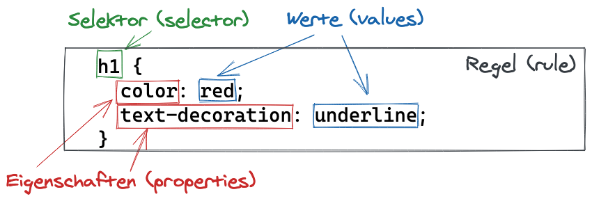

Mit CSS werden beliebig viele **Regeln** definiert. Eine Regel
beginnt mit einem **Selektor** gefolgt von geschweiften Klammern, welche die
gewünschten **Deklarationen** dieser Regel enthalten:

```css
selector {
  declaration1;
  declaration2;
  declaration3;
  ... usw. ...
}
```

### Deklarationen (declarations)

Deklarationen stehen also innerhalb der geschweiften Klammern einer Regel: `{ ... }`.
Daher werden Regeln auch manchmal **Deklarationsblöcke** genannt. Wir werden
allerdings hauptsächlich den Begriff „Regel“ verwenden.

Mehrere aufeinanderfolgende Deklarationen werden durch Semikolon (`;`) voneinander
getrennt und meistens zeilenweise angegeben. Das Semikolon muss allerdings nach
jeder Deklaration angegeben werden, auch wenn es nur eine Deklaration in der Regel gibt.

Eine Deklaration wiederum hat folgende Form:

```css
property: value;
```

Somit besteht eine Deklaration also aus einer **Eigenschaft** (_property_) gefolgt
von einem Doppelpunkt (`:`), auf den wiederum der **Wert** (_value_) der Eigenschaft
folgt mit abschließendem Semikolon (`;`). Mit Eigenschaften wird bestimmt, welche
Aspekte der Gestaltung durch diese Regel angepasst werden sollen. Dies könnte z.B.
die Farbe der Schrift sein. Erreicht wird dies durch die Eigenschaft `color`.
CSS legt auch fest, welche Werte für eine Eigenschaft in Frage kommen. Bei der
Eigenschaft `color` ist dies ein Farbwert wie z.B. `red` oder ein hexadezimaler
Farbwert wie z.B. `#FF0000`, der den gleichen Farbton wie `red` liefert. Eine
Deklaration für die Verwendung einer roten Schriftfarbe könnte also so aussehen:

```css
color: red;
```

CSS definiert zahlreiche Eigenschaften für verschiedenste gestalterische Darstellungen.
Wir werden in den nachfolgenden Artikeln einige wichtige Eigenschaften und ihre zulässigen
Werte besprechen aber bei weitem nicht alle verfügbaren.

### Selektoren (selectors)

Mit dem Selektor der Regel wird schließlich festgelegt, welche Elemente des betroffenen
HTML-Dokuments durch diese Regel gestaltet werden sollen. Selektoren sind sehr vielseitig
einsatzbar und können einzelne oder mehrere Elemente des HTML-Dokuments auswählen. Wenn
wir z.B. _alle_ `<h1>`-Elemente (also die Hauptüberschriften) eines Dokuments in roter
Farbe und unterstrichen darstellen wollen, dann kann dies durch einen Elementselektor
erreicht werden, der lediglich aus dem Tagnamen `h1` besteht. Die entsprechende, nun
vollständige CSS-Regel könnte z.B. folgende Form haben:

```css
h1 {
  color: red;
  text-decoration: underline;
}
```

Alle `<h1>`-Elemente des durch diese CSS-Regel betroffenen HTML-Dokuments erscheinen
also unterstrichen und in roter Farbe:

<h1 style="font-family: serif; color: red; text-decoration: underline;">Überschrift durch CSS angepasst</h1>

Im Allgemeinen hat eine CSS-Regel also folgende Form:

```css
selector {
  just_a_property: some_value;
  another_property: some_other_value;
  /* usw. … */
}
```

Folgende Abbildung stellt nochmals die einzelnen Bestandteile einer CSS-Regel dar:



Stylesheets enthalten natürlich mehr als nur eine Regel. Jede Regel wird als eigener
Deklarationsblock in CSS angegeben:

```css
selector1 {
  just_a_property1: some_value1;
  another_property1: some_other_value1;
  /* usw. … */
}

selector2 {
  just_a_property2: some_value2;
  another_property2: some_other_value2;
  /* usw. … */
}

/* usw. … */
```

### Kommentare in CSS

Kommentare in CSS werden von `/*` und `*/` umgeben:

```css
/* einzeiliger Kommentar */
/* oder über
  mehrere
  Zeilen
  hinweg
*/
```

Dies bedeutet, dass alles zwischen `/* ... */` ignoriert und nicht als CSS interpretiert
wird (auch über mehrere Zeilen hinweg).
